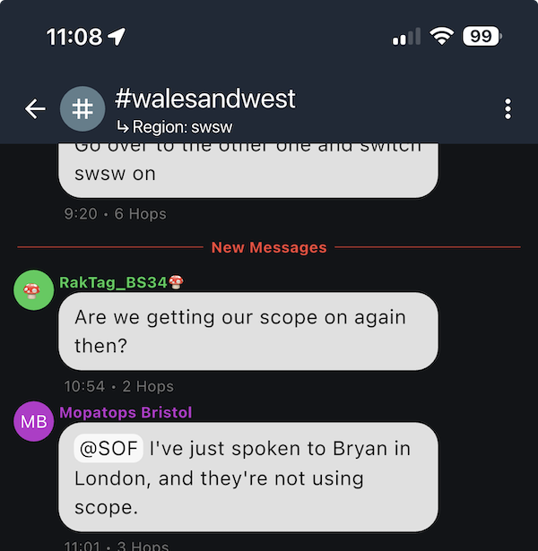

[Home](README.md)

# Channels

## Current Local Channels 

Hashtag channels can be joined by anyone and the [Region](Regions.md) is an **optional** way of limiting how far your messages get propagated across the mesh for [Traffic Management](Traffic-Management.md) purposes. For example, to prevent a message you post in the Bristol channel from flooding across the entire mesh, possibly internationally.

| Hashtag Channel Name     | Region                  | Notes                                                                                           |
| ------------------------ | ----------------------- | ----------------------------------------------------------------------------------------------- |
| `#bristol`               | `#bs`                   | [Daniel's Suggested Bristol Settings Page](https://codeberg.org/danieldurrans/meshcore-bristol) |
| `#cornwall`              |                         |                                                                                                 |
| `#cornwallanddevon`      |                         |                                                                                                 |
| `#devon`                 |                         |                                                                                                 |
| `#exeter`                | `#ex`                   |                                                                                                 |
| `#gloucestershire`       | `#gl`                   |                                                                                                 |
| `#hereford`              |                         |                                                                                                 |
| `#somerset-swsw`         | `#swsw`                 |                                                                                                 |
| `#somerset`              |                         |                                                                                                 |
| `#swindon`               |                         |                                                                                                 |
| `#walesandwest-chat`     | **None**                | Unscoped channel for whole region                                                               |
| `#walesandwest`          | `#swsw`                 | Scoped channel for whole region                                                                 |

## Public Hashtag Channels

These are a relatively straight forward concept, and one need only know what they're called in order to add them via your MeshCore app from the Channels tab via the "..." menu.

## Companion Channel Configuration

Setting a [Region](Regions.md) for a channel can be done via the "..." menu at the top of a channel.
Once successfully done it will be visible at the top of the channel below its name:

