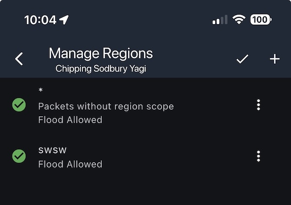

# South Wales and South West Channel and Scope Strategy

This document is an attempt at centralising and documenting the evolving strategy for this regional area's use of channels and region scopes.

It's not an attempt to dictate what we do but rather document what we are doing.

It's also not intended as comprehensive documentation of the all relevant MeshCore features, that's better done by the official documentation on the main [MeshCore site](https://meshcore.co.uk),  [YouTube Channel](https://www.youtube.com/@meshcore-official) videos and [Discord](https://discord.com/channels/1343693475589263471/1354436436199473254) .

## Comments and Suggestions Are Welcome

To suggest changes/additions tag me (PoorSignal) in the [United Kingdom - South West England (and South Wales)](https://discord.com/channels/1343693475589263471/1354436436199473254) Discord group and I'll do my best to keep things up to date.

## Current Local Channels

See later for explanations of what hash channels and scopes are and how to manage them.

| Hashtag Channel Name     | Regional Scopes | Notes          |
| ------------------------ | --------------- | -------------- |
| ```#walesandwest-chat``` |                 |                |
| ```#walesandwest```      | ```#swsw```     | Scoped channel |
| ```#somerset```          |                 |                |
| ```#somerset-swsw```     | ```#swsw```     | Scoped channel |

## Public Hashtag Channels

These are a relatively straight forward concept, and one need only know what they're called in order to add them via your MeshCore app from the Channels tab via the "..." menu.

## Regional Scopes

### Regional Scopes 101

Regional scopes are a feature designed to limit the propagation of messages to regions in order to reduce unnecessary traffic across the wider mesh. This is becoming an issue as the mesh expands and congestion is increasing with traffic.

A repeater is by default is configured to re-broadcast all channel flood messages, By configuring it with scopes, it will continue to re-broadcast un-scoped messages but will drop any scoped ones not in it's whitelist.

Thus a channel can be assigned one or more scope(s) by an individual user such that anything they post in that channel will have the scope assigned. Consequently its flood transmission will be limited to local repeaters that accept that region scope, and will be dropped by more distant repeaters that only support other region scopes. It's a cooperative opt-in mechanism.

However, to successfully use scopes both the local repeaters must be configured to forward messages with the local region scopes **and** users individual channel configurations must be assigned appropriate supported scopes.

This is clearly a complex area and further information for that can be found below:

- [Repeater CLI: Region Management](https://github.com/meshcore-dev/MeshCore/blob/main/docs/cli_commands.md#region-management-v110)
- [Region Filtering](https://buymeacoffee.com/ripplebiz/region-filtering)

### Issues With Scopes

We are in a period of transition at the moment where regional scope is only supported by more recent repeater firmware and app versions. There is no central management in place or even a much of a suggested strategy. Until scopes are properly understood and configured by the majority of repeaters and users there is the chance of unforeseen consequences:

- Un-scoped messages intended for a region can be unnecessarily broadcast across the entire mesh if they hit repeaters with no scope configuration.
- People visiting a scoped channel from outside the region might be surprised to not see messages as they've been dropped by repeaters on their paths. Similarly people travelling outside their region will be able to post to a scoped channel but not have the messages reach the intended recipients.
- While a region contains a mix of repeaters with and without scope configuration and a mix of versions where the feature is or is not implemented, scoped message propagation will be somewhat haphazard.
- Local geography and large propagation paths can mean that a repeater that's critically important for a region does not actually fall within that region. Care should be taken when adding scopes so as not to cut off access to distant islands of repeaters.

### Basic Scope Management

There are two aspects to scopes:

- Configuring the companion to assign a scope to a channel such that any messages that user  post within it are scoped.
- Configuring a repeater to re-broadcast messages with known scopes (or none) and drop any with unknown/unwanted scopes.

#### Companion Channel Configuration

Setting scopes for a channel can be done via the "..." menu at the top of a channel.
Once successfully done it will be visible at the top of the channel below its name:

![[viewing-scope.png]]

#### Repeater Configuration

A repeater will re-broadcast flood messages that have no scope by default.  By adding region scopes it can be configured to drop any channel messages that have unknown/unwanted scopes.

Below are examples of setting the ```#swsw``` scope.

This can be done with the Repeater CLI:

```
region put #swsw
region allowf #swsw
region save
```

It can also be done with **Manage Regions** in the Repeater Admin screen:

