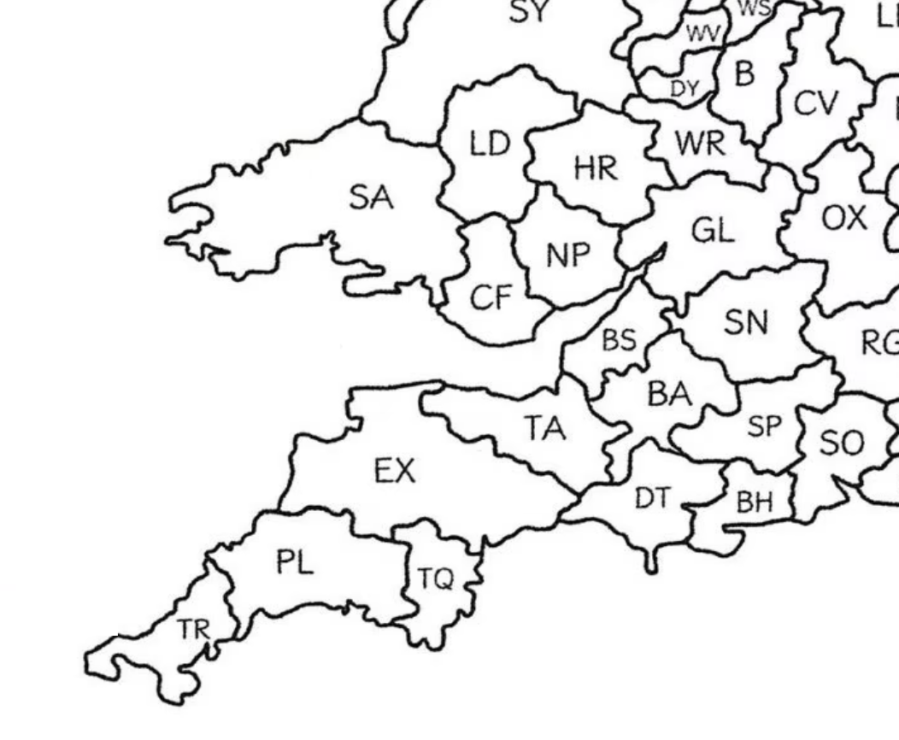
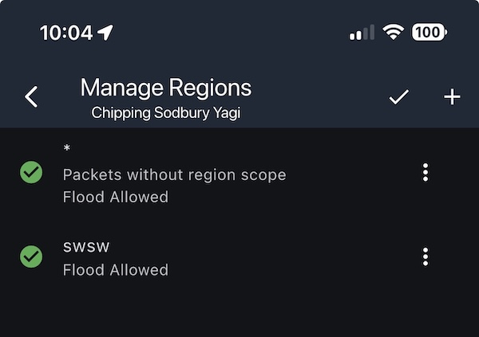

[Home](README.md)

# Regions

Regions are a mechanism that allow you to limit the propagation messages you send in [Channels](Channels.md).

**Important: if you don't want the hassle of thinking about regions/scopes then just do nothing and everything will work.** It's something you can revisit later.

## Current Regions/Scopes

The terms **region** and **scope** tend to be used interchangeably.

After the initial introduction of the `#swsw` region for the South West and South Wales there has been discussion that this perhaps doesn't provide enough granularity and the use of postcode prefixes seems to be gaining some traction with the introduction of `#bs` for Bristol. The idea behind this is that it's an existing scheme that people already understand. The strategy is to add regions for your specific and adjacent postcodes to your repeaters for propagation, and denying propagation for unknown regions/scopes.

The following are regions that may potentially be used locally:

| Region  | Area                                     |
| ------- | ---------------------------------------- |
| `#swsw` | Entire South West And South Wales region |
| `#ba`   | Bath                                     |
| `#bh`   | Bournmouth                               |
| `#bs`   | Bristol                                  |
| `#cf`   | Cardiff                                  |
| `#dt`   | Dorset                                   |
| `#ex`   | Exeter                                   |
| `#gl`   | Gloucestershire                          |
| `#hr`   | Herefordshire                            |
| `#ld`   | Llandrindod Wells (mid wales)            |
| `#np`   | Newport                                  |
| `#pl`   | Plymouth                                 |
| `#sa`   | Swansea                                  |
| `#sn`   | Swindon                                  |
| `#sp`   | Salisbury                                |
| `#ta`   | Taunton                                  |
| `#tq`   | Torquay                                  |
| `#tr`   | Truro                                    |
| `#wr`   | Worcestershire                           |



## Regional Scopes 101

Regional scopes are a feature designed to limit the propagation of messages to regions in order to reduce unnecessary traffic across the wider mesh. This is becoming an issue as the mesh expands and congestion is increasing with traffic.

A repeater is by default is configured to re-broadcast all channel flood messages. By configuring it with scopes, it will continue to re-broadcast un-scoped messages but will drop any scoped ones not in it's whitelist.

Thus a channel can be assigned a scope by an individual user such that anything they post in that channel will have the scope assigned. Consequently its flood transmission will be limited to local repeaters that re-broadcast that region scope, and will be dropped by more distant repeaters that only support other region scopes. It's a cooperative opt-in mechanism.

However, to successfully use scopes both the local repeaters must be configured to forward messages with the local region scopes **and** users individual channel configurations must be assigned appropriate supported scopes.

**Note:** It is also possible to block **all** un-scoped traffic and while some people are doing this it does not yet seem to be common practice. This issue with doing so is that new users joining the mesh and using the default configuration will have their messages silently dropped.

This is clearly a complex area and further information for that can be found below:

- [Region Management(https://docs.meshcore.io/cli_commands/#region-management-v110)
- [Region Filtering](https://buymeacoffee.com/ripplebiz/region-filtering)

## Issues With Scopes

We are in a period of transition at the moment where regional scope is only supported by more recent repeater firmware and app versions. There is no central management in place or even a much of a suggested strategy. Until scopes are properly understood and configured by the majority of repeaters and users there is the chance of unforeseen consequences:

- Scoped messages intended for a regional channel can be unnecessarily broadcast across the entire mesh if they hit repeaters with no scope configuration.
- People visiting a scoped channel from outside the region might be surprised to not see messages as they've been dropped by repeaters on their paths. Similarly people travelling outside their region will be able to post to a scoped channel but not have the messages reach the intended recipients.
- While a region contains a mix of repeaters with and without scope configuration and a mix of versions where the feature is or is not implemented, scoped message propagation will be somewhat haphazard.
- Local geography and large propagation paths can mean that a repeater that's critically important for a region does not actually fall within that region. Care should be taken when adding scopes so as not to cut off access to adjacent islands of repeaters.

## Basic Scope Management

There are two aspects to scopes:

- Configuring the companion to assign a scope to a channel such that any messages that user  post within it are scoped.
- Configuring a repeater to re-broadcast messages with known scopes (or none) and drop any with unknown/unwanted scopes.

## Repeater Configuration

A repeater will re-broadcast flood messages that have no scope by default.  By adding region scopes it can be configured to drop any channel messages that have unknown/unwanted scopes.

Below are examples of setting the `#swsw` scope.

This can be done with the Repeater CLI:

```
region put #swsw
region allowf #swsw
region save
```

It can also be done with **Manage Regions** in the Repeater Admin screen:

